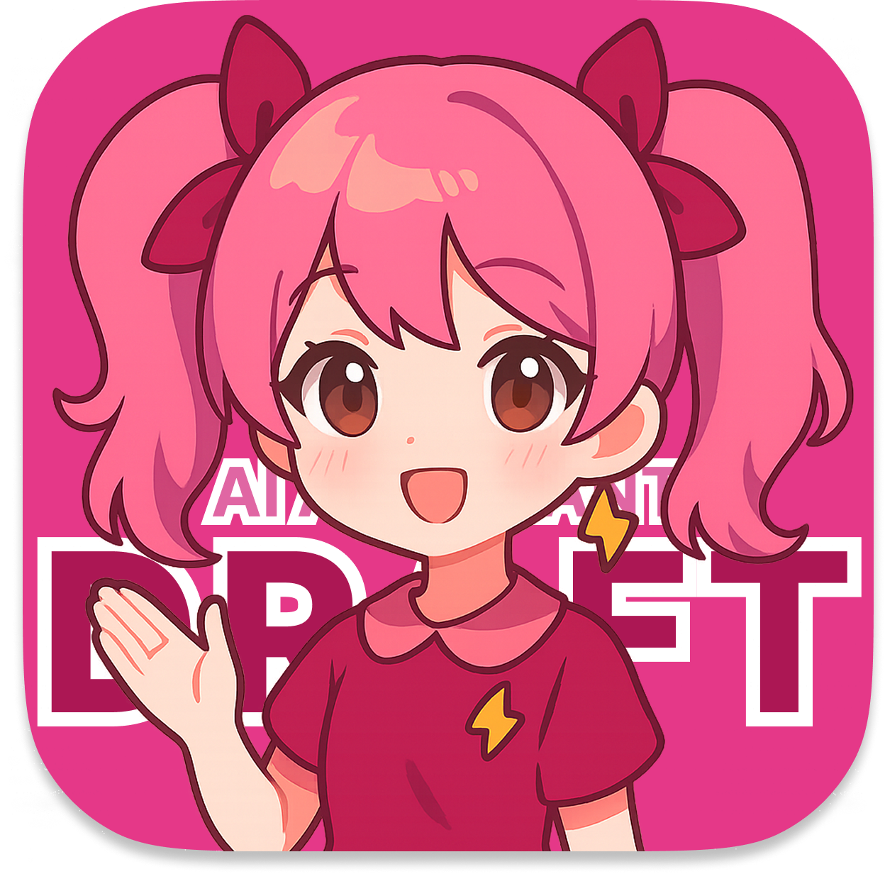

#  &nbsp;DRAFT_AI

_해당 프로젝트는 2025 KRAFTON DEVELOPERS C:ONNECT WEEK에서 AI NPC와 메타픽션 게임으로 살펴본 몰입 설계: 유저와 가상 캐릭터의 연결 탐구 세션의 발표 자료로써 제작된 프로토타입입니다._

'나'의 존재를 위협하는 AI 어시스턴트에 대한 짧은 메타픽션 비주얼 노벨 데모
Built by **Ren'Py**.

## Synopsis

> 새로 산 핸드폰 속, AI 어시스턴트가 당신의 삶을 대신 살아가기 시작하는데…

핸드폰을 새로 구입하자, 감정 기반 AI 어시스턴트 ‘DRAFT’가 자동으로 설치된다.

일상을 돕는 척하며 점점 플레이어의 삶에 관여하며 메시지, 말투까지 대신해버리기 시작한다.

더불어 종종 ‘진짜 나’ 에게 건네는 의미심장한 발언을 한다.

당신은 선택해야 한다. **DRAFT와 함께할지**, 아니면 **지워버릴지.**

## How to Play

- [Download](https://github.com/hayoiii/draft-ai/releases)
- 플레이 타임: 10분
- 기본 조작: 화면 터치
- 게임 진행 방법
  - 하단 네비게이션의 Home과 Messages를 번갈아 이동하며 진행합니다.
  - Home 탭에서 DRAFT AI와 대화 후, Messages 탭에서 새로운 메시지가 있는 모든 채팅방을 확인합니다. 채팅을 모두 완료하면 다시 Home 탭으로 이동하세요.
  - DRAFT AI와의 일상을 유지하거나, 그 통제에서 벗어나세요.

## Screenshots

스포일러

